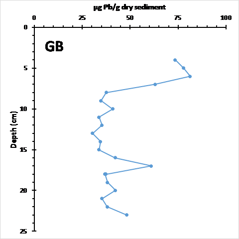
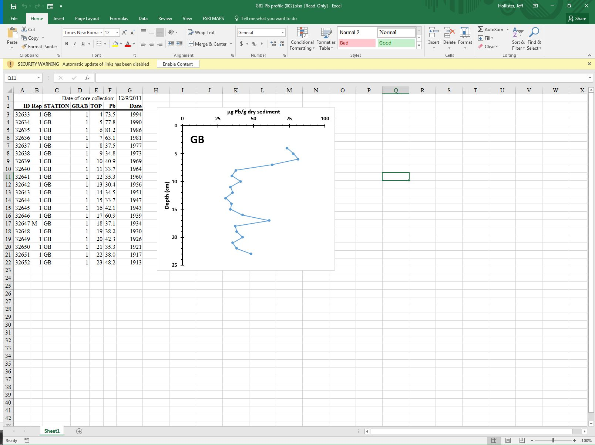

```{r setup, echo=FALSE, warning=FALSE, purl=FALSE, message=FALSE}
library(knitr)
options(repos="http://cran.rstudio.com/")
pkgs <- c("dplyr","ggplot2")
x<-lapply(pkgs, library, character.only = TRUE)
opts_chunk$set(tidy=T, root.dir = "meetings")
```
 
# Making the figures

For this short workshop we will use two datasets and create two separate plots, a bar chart with error bars and a depth profile plot.  From this we should learn how to create these plots with `ggplot2`, learn that datasets need to be manipulated for different visualizations, and learn how to save the plots to files for inclusion into a manuscript.  

## Bar chart with error bars

(These instructions inspired by the [R Graphics Cookbook](http://www.cookbook-r.com/Graphs/Plotting_means_and_error_bars_(ggplot2)/#bar-graphs))

Prior to jumping into coding any figure I like to think a bit about what I want to show and will actually sketch that out on paper.  Doing this also forces you to start thinking about what data you need to create that figure. In the case of the bar chart with error bars at a minimum we will need some mean value to plot and some representation of error for the error bars.  Another common thing to do is plot this for multiple categories and for multiple values.  
For this example, we will be interested in looking at Nitrogen and Phosphorus concentrations across ecoregions.  Let's first start with the data.

### Data for bar chart: NLA 2012

Assuming we still have access to it, we will use the NLA 2012 water quality data for the bar chart with error bars.  Specifically we will be interested in total nitrogen, total phosphorus, and ecoregion.  First, let's load up our packages:

```{r packages}
library(dplyr) # For some basic data massaging
library(tidyr) # Also for some basic data massaging
library(ggplot2) # For the plots
```

Next, to get the data:

```{r data}
nla12_wq_url <- "https://www.epa.gov/sites/production/files/2016-12/nla2012_waterchem_wide.csv"
nla12_site_url <- "https://www.epa.gov/sites/production/files/2016-12/nla2012_wide_siteinfo_08232016.csv"

# Read, join, filter, select data
nla12_wq <- read.csv(nla12_wq_url, stringsAsFactors = FALSE) 
nla12_site <- read.csv(nla12_site_url, stringsAsFactors = FALSE)
nla12 <- full_join(nla12_wq,nla12_site) %>%
  filter(VISIT_NO == 1) %>%
  select(SITE_ID, FW_ECO9, NTL_RESULT, PTL_RESULT) %>%
  na.omit()
tbl_df(nla12)  
```

So now we have total nutrients and a categorical representing the ecoregion for the data.  Chances are that the data won't be in the form that we need to actually build the plot.  

### Manipulating the data
Remember, for this example we are going to plot nutrients vs. ecoregions, thus, we will need to summarize the per lake data on an ecoregional basis and get the mean and standard error for each nutrient within each ecoregion.   Also, many of the `ggplot2` functions will easily create seperate plots if a catergorical factor is supplied.  We will keep this in mind becuase we want different bars for each of the variables.

Given this we need a data frame that looks like:

|Ecoregion|Nutrient|Mean|Standard Error|
|---------|--------|----|--------------|


```{r barchart_data}
nla12_bar_mean <- nla12 %>%
  group_by(FW_ECO9) %>%
  summarize(nitrogen = mean(log1p(NTL_RESULT)),
            phosphorus = mean(log1p(PTL_RESULT))) %>%
  gather("variable", "mean", 2:3)

nla12_bar_se <- nla12 %>%
  group_by(FW_ECO9) %>%
  summarize(nitrogen = sd(log1p(NTL_RESULT))/sqrt(length(NTL_RESULT)),
            phosphorus = sd(log1p(PTL_RESULT))/sqrt(length(PTL_RESULT))) %>%
  gather("variable", "std_error", 2:3)

nla12_bar_data <- full_join(nla12_bar_mean, nla12_bar_se)
nla12_bar_data
```

Now that was easy!  I am being sarcastic, because getting the data ready is really about 90% of the effort.  In reality this usually takes me a couple of iterations of getting things wrong. Now we can use this to build out our plot.

```{r barchart}
nla12_bar <- ggplot(nla12_bar_data,aes(x = FW_ECO9, y = mean, fill = variable)) +
  geom_bar(stat = "identity", position = position_dodge()) +
  geom_errorbar(aes(ymin=mean-std_error, ymax=mean+std_error),
                  width=.2,                    # Width of the error bars
                  position=position_dodge(.9))

nla12_bar
```

So that looks pretty good, but their might be a lot of other change you might want to see with this figure.  We will consider three:

### Re-order x-axis

I find bar charts to be fairly difficult to read accurately so getting order of the ecoregions is not easy.  One way to get at that is to order the x-axis based on one of the variables.  For this we will re-order the axis, in descending order of mean Phosphorus.  `ggplot2` uses the order of a factor to do this. And while we could do this with base R, that'd make our heads hurt, so Hadley to the rescue with the `forcats` package and som `magrittr` kung fu.

```{r reorder}
library(forcats)
# First create a character vector of levels in the proper order
eco9_ord <- nla12_bar_data %>%
  filter(variable == "phosphorus") %>%
  arrange(desc(mean)) %>%
  .$FW_ECO9

nla12_bar_data <- nla12_bar_data %>%
  mutate(desc_ecoregion = fct_relevel(factor(FW_ECO9,eco9_ord)))
```

Now with that done, we can recreate our plot from above

```{r barchart_order}
nla12_bar <- ggplot(nla12_bar_data,aes(x = desc_ecoregion, y = mean, fill = variable)) +
  geom_bar(stat = "identity", position = position_dodge()) +
  geom_errorbar(aes(ymin=mean-std_error, ymax=mean+std_error),
                  width=.2,                    # Width of the error bars
                  position=position_dodge(.9))

nla12_bar
```

And lastly maybe I want phosphorus first.  This is a bit more straightforward.

```{r barchart2}
nla12_bar <- ggplot(nla12_bar_data,aes(x = desc_ecoregion, y = mean, fill = fct_relevel(factor(variable),"phosphorus" ,"nitrogen")))+
  geom_bar(stat = "identity", position = position_dodge()) +
  geom_errorbar(aes(ymin=mean-std_error, ymax=mean+std_error),
                  width=.2,                    # Width of the error bars
                  position=position_dodge(.9))

nla12_bar
```

### Change color of bars

Believe it or not, there is a fair bit of research behind which colors we should use for plots that aid in interpretation, are readable by those with colorblindness, etc.  So the defualt is probably good while we build the plot, but we almost always want to move beyond that.  For this we will use the [`viridis` package](https://cran.r-project.org/web/packages/viridis/vignettes/intro-to-viridis.html)

```{r viridis}
library(viridis)
nla12_bar <- nla12_bar +
  scale_fill_viridis(discrete=TRUE)

nla12_bar
```

### Move beyond the default theme

Lastly, the default theme is fine, but we probably want to tweak it some.  In particular for this plot let's change up the background and fix our legend title.

First, let's fix the legend title.

```{r legend}
nla12_bar <- nla12_bar +
  guides(fill = guide_legend(title = "Nutrients"))

nla12_bar
```

Now let's work on a different look and feel.

```{r themes1}
nla12_bar <- nla12_bar +
   labs(x = "Mean Concentration", y = "Ecoregions")+
   theme(text = element_text(family="serif"),
         panel.background = element_blank(), panel.grid = element_blank(), 
         panel.border = element_rect(fill = NA), 
         plot.title  = element_text(family="sans",size=12,face="bold",vjust=1.1),
         legend.position = c(0.85,0.85), legend.key = element_rect(fill = 'white'),
         legend.text = element_text(family="sans",size=15), 
         legend.title = element_text(family="sans",size=11),
         axis.title.x = element_text(family="sans",vjust = -0.5, size = 12),
         axis.title.y = element_text(family="sans",vjust = 1.5, size = 12),
         axis.text.x = element_text(family="sans",size = 11),
         axis.text.y = element_text(family="sans",size = 11))
nla12_bar
```

This shows the way to do that with a bunch of custom settings.  For a quicker version of doing this, you can use some of the canned themes in `ggplot2` or use the `ggthemes` package for many additional ones.  Some example sof using one of the `ggplot2` ones is below.  Also note, I am not saving these to an object so result is a temporary view of what the plot would have looked like.

```{r canned}
nla12_bar + 
  theme_bw()

nla12_bar +
  theme_classic()

nla12_bar +
  theme_minimal()
```

### Saving the figure

Once you have the details of your figure, figured (he, he) out you need to move it from the screen and into your manuscript.  This requires saving the output to a file.  The `ggplot2` package comes with a function to facilitate this, `ggsave()`.  To output a ggplot2 object to a high resolution tiff:

```{r ggsave, eval = FALSE}
ggsave(filename = "nla_bar_chart.tiff",
       plot = nla12_bar,
       width = 8,
       height = 4,
       units = "in", 
       dpi = 300)
```

This should get you pretty close to providing the figures required by the journal you are submitting too.  If there are additional things you need to do your figure you can either edit the file directly in an image processing program (e.g. gimp or irfanview) or you can manipulate the file in R with the `magick` package, essentially an R client for ImageMagick.  Using `magick` is a bit beyond the scope of what we want to do today, but I will show a quick example of something I had to do for a paper recently: remlibmagick++-devove white space around borders of the image.  We can do with this using the auto crop functionality in `magick`.

```{r autocrop, eval = FALSE}
library(magick)
nla_fig <- image_read("nla_bar_chart.tiff")
nla_fig <- image_trim(nla_fig)
image_write(nla_fig, "nla_bar_chart_trim.tiff" )
```

The original tiff:


The trimmed version:


### Exercise 1. Make a bar chart

1.) Let's make a similar chart, but instead of nutrients, let's plot mean and standard error of turbidity by HUC Regions (HUC2).
2.) To get you started, the data needs to be manipulated:

```{r barchart_data_ex, eval = FALSE}
nla12_turb <- full_join(nla12_wq,nla12_site) %>%
  filter(VISIT_NO == 1) %>%
  select(SITE_ID, HUC2, TURB_RESULT) %>%
  na.omit()

nla12_bar_mean_turb <- nla12_turb %>%
  group_by(HUC2) %>%
  summarize(mean = mean(TURB_RESULT))

nla12_bar_se_turb <- nla12_turb %>%
  group_by(HUC2) %>%
  summarize(nitrogen = sd(TURB_RESULT)/sqrt(length(TURB_RESULT)))
          
nla12_bar_data_turb <- full_join(nla12_bar_mean_turb, nla12_bar_se_turb)
```

3.) Now look back at the examples and see if you can create a bar chart that shows the mean,  and error bars of turbidity by HUC Region.

## Depth Profile, ala Warren

(Shout out to EPA colleague Warren Boothman for suggesting this and providing example data.)

A common type of plot is a depth profile where some measurement is recorded along a depth.  These are commonly done in limnology and oceanography, but also done for sediment or soil cores.  The example we will be trying to re-create is a sediment core with measurements of lead.  As an example here is a plot Warren created with Excel:



The full use case that Warren and I discussed about this was to create a way to create these plots of many sites.  To me, this calls out for writing a function that creates the plots.  Prior to jumping into that, what we can do is get the data set up and the plot figured out.

### Get the data

Again, thanks to Warren for providing the example data which is saved as a spreadsheet. Overall the fromatting is pretty clean (which is good), but there are a few things we will need to do read it in properly.  Here's a screen grab of what the spreadsheet looks like:



Overall, not bad.  The figure won't get read in and we have an extra line at the top that we need to deal with.  

```{r readxl}
library(readxl)
core <- readxl::read_excel("profile.xlsx",skip = 1)
core
```

So that got us pretty close, but first thing you'll notice is that the dates are completely wacky.  We will ignore that for the time being (subject of another meeting, perhaps).

### Build the plot

First thing we need to do is get the basic `ggplot2` object set up:

```{r ggprofile}
ggprofile <- ggplot(core,aes(x = Pb, y = TOP)) +
  geom_point(color = "#5b9bd5") +
  geom_path(color = "#5b9bd5")
ggprofile
```

### Set up the x-axis

```{r ggprofile2}
x_brks <- seq(0, 100, by = 25)
x_minor_brks <- seq(0, 100, by = 5)
ggprofile <- ggprofile +
  scale_x_continuous(position = "top", 
                     breaks = x_brks,
                     minor_breaks = x_minor_brks,
                     limits = c(0,100),
                     expand = c(0, 0))
ggprofile
```

### Set up the y-axis

```{r ggprofile3}
y_brks <- seq(0, 25, by = 5)
y_minor_brks <- seq(0, 25)
ggprofile <- ggprofile +
  scale_y_continuous(trans = "reverse",
                     breaks = y_brks,
                     minor_breaks = y_minor_brks,
                     limits = c(25, 0), #it's in reverse order
                     expand = c(0, 0)) 
ggprofile
```

### Customize the look and feel.

The plot that we are trying to mimic has no panel, has tick marks on the axes, has some custom labels, and is plotted in a different color.

```{r ggprofile4}
ggprofile <- ggprofile + 
  labs(x = "ug Pb/g dry sediment",
       y = "Depth (cm)") +
  annotate("text", x = 10, y = 2.5, label = "GB", fontface = "bold", size = 9) +
  theme(text = element_text(family="Calibri"),
        panel.background = element_blank(), 
        panel.grid = element_blank(),
        axis.line = element_line(size = 0.75),
        axis.ticks = element_line(size = 0.75),
        axis.ticks.length = unit(0.05, "in"),
        axis.text = element_text(face = "bold"))
ggprofile
```

### The whole thing

```{r ggprofile_all}
x_brks <- seq(0, 100, by = 5)
x_tick_labels <- x_brks
x_tick_labels[0 != x_tick_labels %% 25] <- ""
y_brks <- 25:0
y_tick_labels <- y_brks
y_tick_labels[0 != y_tick_labels %% 5] <- ""
ggprofile <- ggplot(core,aes(x = Pb, y = TOP)) +
  geom_point(color = "#5b9bd5") +
  geom_path(color = "#5b9bd5") +
  scale_x_continuous(position = "top", 
                     limits = c(0,100),
                     expand = c(0, 0), 
                     breaks = x_brks,
                     labels = x_tick_labels) +
  scale_y_continuous(trans = "reverse",
                     limits = c(25, 0),
                     expand = c(0, 0),
                     breaks = y_brks,
                     labels = y_tick_labels) +
  labs(x = expression(paste(mu,"g Pb/g dry sediment", sep="")),
       y = "Depth (cm)") + 
  annotate("text", x = 10, y = 2.5, label = "GB", fontface = "bold", size = 9) +
  theme(text = element_text(family="Calibri"),
        panel.background = element_blank(), 
        panel.grid = element_blank(),
        axis.line = element_line(size = 0.75),
        axis.ticks = element_line(size = 0.75),
        axis.ticks.length = unit(0.05, "in"), 
        axis.text = element_text(face = "bold"),
        axis.title = element_text(face = "bold", size = 12))
ggprofile
```

### What If you need a lot of them?

Often you have multiple sites, and as long as you data is set up to handle it, you can kick out a lot of figures using essentially the same code.  As an example, we can create some new data

```{r new_core}
new_core <- core
new_core$STATION <- "NEW"
core <- rbind(core, new_core)
```

With new data, we can create a function for out plot, and wrap that in a loop.

```{r function}
prof_plot <- function(df, label){
  x_brks <- seq(0, 100, by = 5)
x_tick_labels <- x_brks
x_tick_labels[0 != x_tick_labels %% 25] <- ""
y_brks <- 25:0
y_tick_labels <- y_brks
y_tick_labels[0 != y_tick_labels %% 5] <- ""
ggprofile <- ggplot(df,aes(x = Pb, y = TOP)) +
  geom_point(color = "#5b9bd5") +
  geom_path(color = "#5b9bd5") +
  scale_x_continuous(position = "top", 
                     limits = c(0,100),
                     expand = c(0, 0), 
                     breaks = x_brks,
                     labels = x_tick_labels) +
  scale_y_continuous(trans = "reverse",
                     limits = c(25, 0),
                     expand = c(0, 0),
                     breaks = y_brks,
                     labels = y_tick_labels) +
  labs(x = expression(paste(mu,"g Pb/g dry sediment", sep="")),
       y = "Depth (cm)") + 
  annotate("text", x = 10, y = 2.5, label = label, fontface = "bold", size = 9) +
  theme(text = element_text(family="Calibri"),
        panel.background = element_blank(), 
        panel.grid = element_blank(),
        axis.line = element_line(size = 0.75),
        axis.ticks = element_line(size = 0.75),
        axis.ticks.length = unit(0.05, "in"), 
        axis.text = element_text(face = "bold"),
        axis.title = element_text(face = "bold", size = 12))
return(ggprofile)
}
```

And loop based on the station:

```{r loop}
for (i in unique(core$STATION)){
core_sub <- core %>%
  filter(STATION == i)
plt <- prof_plot(core_sub,i)
ggsave(file = paste0(i,"_profile.jpg"), plot = plt, 
       height = 5, width = 5, dpi = 300)
}
```
